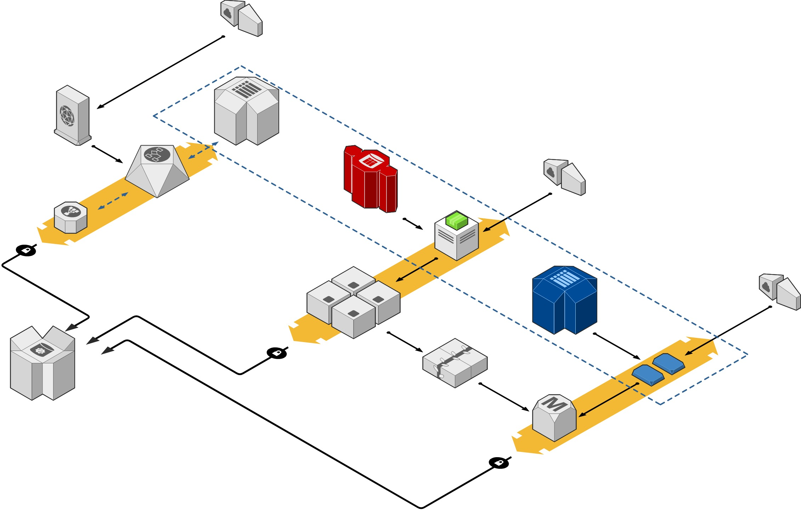

=================
feature-krib-demo
=================

Intent
  This feature is used to demonstate the krib package through the drp-ux.
Success
  Demonstrate krib install and useage

Manual Steps

#. Configure network (mikrotek 192.168.88.1 router)
#. Install drp-provision via drp-quickstart_
#. Start drp-provision vis the command below::

    sudo ./dr-provision --static-ip=192.168.88.9 --base-root=/Users/msops/Code/drpfeature/drpisolated/drp-data --local-content="" --default-content=""

#. Browse to RackN-Portal at https://192.168.88.9:8092 and login with rocketskates r0cketsk8ts

.. _drp-quickstart: http://provision.readthedocs.io/en/tip/doc/quickstart.html
.. _drp-krib-video: https://www.youtube.com/watch?v=Psm9aOWzfWk&feature=youtu.be

Network Stuff

catmini:drpisolated msops$ sudo ./dr-provision --static-ip=192.168.88.9 --base-root=/Users/msops/Code/drpfeature/drpisolated/drp-data --local-content="" --default-content=""
catmini:drpfeature msops$ sudo route -n add -net 255.255.255.255 192.168.88.9

https://www.centos.org/docs/5/html/5.1/Deployment_Guide/s1-server-ports.html

nmap -sT -O localhost

cat /etc/services | grep 834

netstat -anp | grep 834

lsof -i | grep 834

catmini:drpfeature msops$ sudo dhcpdump -i en0

  549  brew install dhcpdump
  550  dhcpdump -i eth0
  551  sudo dhcpdump -i eth0
  552  sudo dhcpdump -i en0
  553  ifconfig
  554  nsdump
  555  netstat
  556  nmap -sT -O 192.168.88.9
  557  brew install nmap
  558  nmap -sT -O 192.168.88.9
  559  sudo nmap -sT -O 192.168.88.9

  mikrotek

192.168.88.1 admin 

IP > DHCP Server > DHCP (D)->(E) (disable the server)

